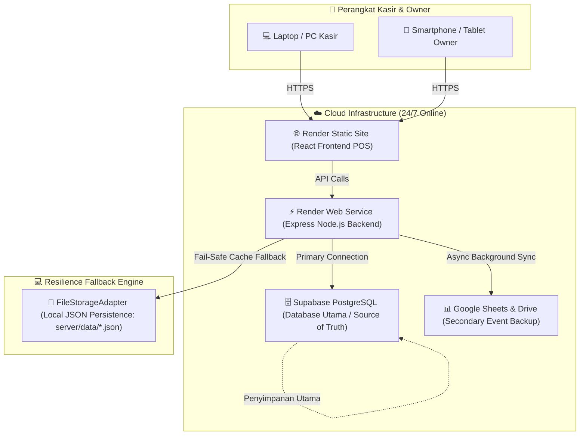

# BLUEPRINT ARSITEKTUR & SISTEM MAINTENANCE POS KASIR

> **Status:** Production Ready (Live & Verified)  
> **Tanggal:** 17 Agustus 2026  
> **Target System:** Toko FC/Printing & F&B  

---

## 1. DIAGRAM BLUEPRINT ARSITEKTUR SISTEM

Sistem POS Kasir didesain menggunakan **Three-Tier Multi-Layer Resilience Architecture** yang menjamin operasional toko berjalan 24/7 tanpa downtime dan tanpa risiko kehilangan data.

---

## 2. SPESIFIKASI DATABASE & SERVER SAAT INI

| Komponen | Teknologi | Status & Alokasi | Keterangan |
| :--- | :--- | :--- | :--- |
| **Database Utama (Primary)** | **Supabase PostgreSQL Cloud** | 🟢 **ACTIVE (100% Gratis & Permanen)** | Lokasi: `aws-0-ap-south-1.pooler.supabase.com:5432`. Tidak ada masa expired 90 hari. |
| **Backend API** | **Express.js (Node.js + TypeScript)** | 🟢 **ACTIVE (Render Cloud)** | URL: `https://pos-kasir-app-1.onrender.com`. Menyala 24/7. |
| **Frontend Web App** | **React + Vite + Vanilla/Tailwind** | 🟢 **ACTIVE (Render Web)** | Antarmuka kasir cepat & responsif. |
| **Backup Sekunder** | **Google Sheets API & Google Drive** | 🟢 **ACTIVE (Background Worker)** | Otomatis mencatat transaksi, shift, & pengeluaran ke Google Sheets. |
| **Fallback Darurat** | **FileStorageAdapter (`server/data/*.json`)** | 🟢 **ACTIVE (Local Storage)** | Menjaga data tetap utuh jika koneksi jaringan terputus sementara. |

---

## 3. PROSEDUR MAINTENANCE & PEMELIHARAAN (STANDARD OPERATING PROCEDURE)

### 🛠️ A. Pemeliharaan Rutin (Tanpa Gangguan Kasir)
1. **Pemberitahuan Sistem**:
   - Pemeliharaan rutin dilakukan di luar jam ramai toko (misal pukul 23:00 - 05:00 WIB).
2. **Ketersediaan Offline Kasir**:
   - Jika koneksi cloud diputus untuk perawatan, sistem **otomatis beralih ke FileStorageAdapter**.
   - Kasir **tetap bisa bertransaksi tanpa popup error**.
3. **Penyelarasan Ulang (Auto Sync)**:
   - Begitu maintenance selesai, server backend secara otomatis menyinkronkan kembali transaksi lokal ke Supabase Database.

---

### 🗂️ B. Prosedur Backup & Recovery Manual (Pemulihan Bencana)

Jika Owner ingin melakukan *backup* manual atau berpindah server:

1. **Backup Data**:
   - Buka menu **Backup & Restore** di Aplikasi POS.
   - Klik **Download Backup (JSON)** untuk mengunduh seluruh data (Users, Products, Transactions, Expenses).
2. **Restorasi Data (1-Click Restore)**:
   - Jika membuat database baru di masa depan, buka halaman **Backup & Restore**.
   - Upload file JSON snapshot -> Klik **Restore**.
   - Seluruh data toko pulih 100% dalam waktu kurang dari 1 menit.

---

## 4. DAFTAR ENTITAS DATA UTAMA DI SUPABASE

1. **`users`**: Data akun Owner, Kasir, dan Penanggung Jawab.
2. **`activation_tokens`**: Token aktivasi akun pegawai baru yang dibuat oleh Owner.
3. **`products`**: Data barang & jasa (FC, Printing, Food & Beverage).
4. **`shifts`**: Catatan jam buka/tutup kasir dan saldo awal/akhir shift.
5. **`transactions` & `transaction_items`**: Riwayat nota penjualan dan item detail.
6. **`expenses`**: Pengeluaran operasional toko.
7. **`audit_logs`**: Catatan aktivitas penting untuk keamanan sistem.
