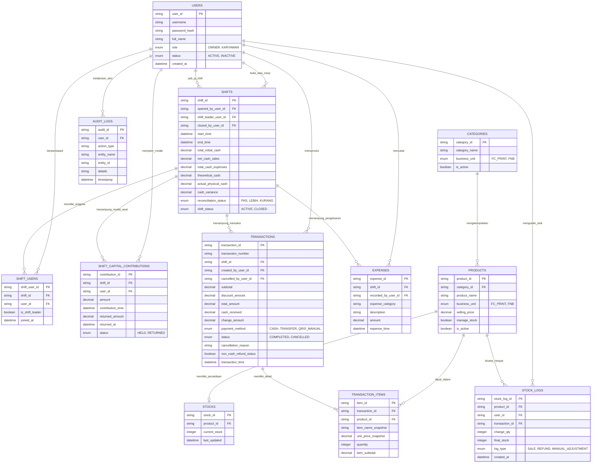

# Entity Relationship Diagram (ERD) - Draft

> **Status:** Draft (Tahap D - Dengan Entitas Kontribusi Modal Multi-User)  
> **Versi:** 0.2.0  
> **Tanggal:** 14 Agustus 2026  

Dokumen ini menjelaskan rancangan entitas data dan hubungan antar entitas untuk Sistem POS Usaha Campuran (FC/Printing & FNB), termasuk entitas baru `SHIFT_CAPITAL_CONTRIBUTIONS` untuk mencatat modal awal dari beberapa karyawan.

---

## 1. DIAGRAM MERMAID ERD

---

## 2. JUSTIFIKASI BISNIS ENTITAS BARU: `SHIFT_CAPITAL_CONTRIBUTIONS`

- **Alasan Bisnis Spesifik:** Modal awal laci kas dapat disetor oleh lebih dari satu karyawan (misal Budi setor Rp50rb, Siti setor Rp50rb). Uang fisik dicampur ke laci kas bersama `Shift ID`, namun entitas ini secara khusus mencatat siapa menyetor berapa, waktu setoran, status pengembalian (`HELD` saat shift berjalan, `RETURNED` setelah closing), serta nominal modal yang dikembalikan kepada masing-masing penyetor.
